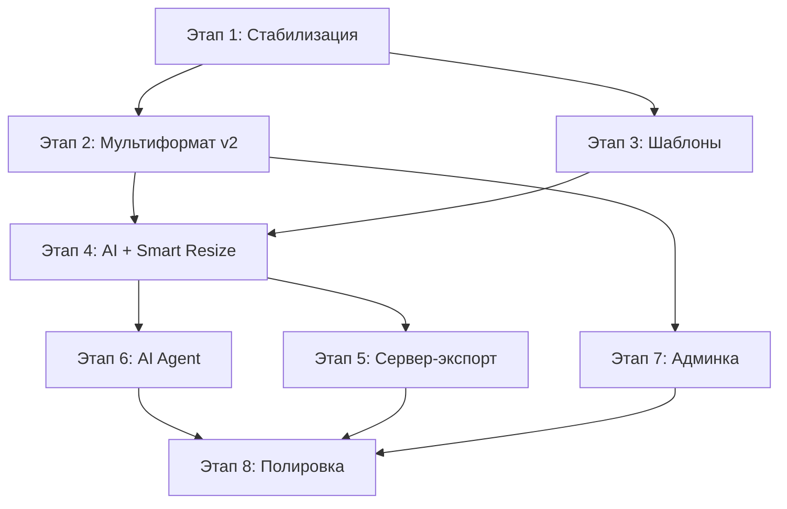

# План разработки Canvas-редактора платформы (v3 — от аудита к продакшену)

## Введение

Данный план построен на глубоком аудите текущей кодовой базы. Вместо подхода «с нуля» мы перешли на **эволюционную стратегию**: опираемся на работающий прототип (Zustand + Konva, tRPC, AI-агент) и достраиваем недостающие модули до продакшен-качества.

### Что уже работает (переиспользуем)
| Компонент | Файл/Модуль | Состояние |
|---|---|---|
| Zustand-стор со слайсами | `canvasStore.ts` (Layer, Viewport, History, Selection, Component, Resize) | ✅ Стабильный |
| Конва-рендер (Pan/Zoom/Select)| `Canvas.tsx`, `CanvasLayer.tsx`, `FrameLayerRenderer.tsx` | ✅ Стабильный |
| Авто-лейаут (Hug/Fill) | `layoutEngine.ts` (712 строк) | ✅ Стабильный, Konva-текст |
| Мастер-Инстанс (legacy) | `createResizeSlice.ts` — legacy path + snapshot path | ⚠️ Работает, нужен рефакторинг |
| Snapshot-форматы | `createResizeSlice.ts` — `layerSnapshot`, `layerBindings`, `applyCascade` | ⚠️ Работает, нужна доводка UX |
| AI-оркестратор | `orchestrator.ts`, `actionRegistry.ts`, `executeAction.ts` | ✅ Работает, VLM + tool-calling |
| AI-стили и пресеты | `useStylePresets.ts`, `/settings/styles` | ✅ Работает |
| CRUD проектов | `project.ts` (tRPC routers), `useProjectSync.ts` | ✅ Стабильный |
| S3-ассеты + миграция | `imageUpload.ts`, автоматическая миграция base64→S3 | ✅ Стабильный |
| Версионирование | `VersionHistoryPanel.tsx`, `useProjectVersions.ts` | ✅ Стабильный |
| Экспорт (единичный + batch) | `ExportModal.tsx` — PNG @1x/@2x, JSZip batch | ✅ Клиентский, нет серверного |
| Визард (3-step flow) | `WizardFlow.tsx` (837 строк) | ✅ Работает |
| Шаблоны (каталог + CRUD) | `TemplatePanel.tsx`, `templateService.ts`, `templateCatalogService.ts` | ✅ Работает |
| Привязка к мастеру | `BindToMasterModal.tsx` — granular sync flags | ✅ Работает |
| Smart Resize | `smartResizeService.ts`, `SlotMappingModal.tsx` | ⚠️ Статический, нужна эвристика |
| Админ-панель | `/admin/page.tsx` — KPI, users, workspaces, AI-cost analytics | ✅ Работает |
| Дашборд проектов | `/page.tsx` — карточки, поиск, избранное, тайлы генерации | ✅ Работает |
| Настройки | `/settings` — тема, бренд-кит, AI-стили | ✅ Работает |

### Стратегические принципы
1. **Backend First** — серверная команда опережает фронтенд: готовит контракты, очереди, миграции
2. **Invisible UI** — интерфейс не конкурирует с контентом
3. **Safe by Default** — AI изменения обратимы, привязки не ломают данные
4. **Human in the Loop** — AI предлагает, человек подтверждает

---

## ЭТАП 1. Стабилизация фундамента и устранение технического долга

**Цель:** Устранить накопленный технический долг, стабилизировать существующие механики до продакшен-качества.

### [ЭПИК 1.1] Рефакторинг двойного формат-движка
> Проблема: в `createResizeSlice.ts` сосуществуют два пути — legacy master/instance (через `masterComponents` + `componentInstances`) и новый snapshot-путь (через `layerSnapshot` + `layerBindings`). Это создаёт баги и усложняет поддержку.

- **Таска 1.1.1: Унификация формат-движка на snapshot-only**
  - *Описание:* Полностью мигрировать на snapshot-based модель. Каждый формат хранит `layerSnapshot[]` — самодостаточный массив слоёв. Убрать legacy-путь `masterComponents.length > 0` из `addResize`, `setActiveResize`, `syncLayersToResize`.
  - *DoD:* Удалён legacy branch в `addResize()` (строки 49–101). `syncLayersToResize()` работает только через авто-лейаут, без мастер-компонентов. Все существующие проекты открываются корректно (миграция старых данных).

- **Таска 1.1.2: Миграция сохранённых проектов**
  - *Описание:* Написать миграционный скрипт в `useLoadCanvasState`, который при загрузке проекта с legacy-данными (masterComponents + componentInstances) конвертирует их в snapshot-формат.
  - *DoD:* Проекты с legacy-данными открываются и сохраняются в новом формате без потери данных. Написан unit-тест на миграцию.

- **Таска 1.1.3: Рефакторинг типов форматов**
  - *Описание:* Очистить `ResizeFormat` от устаревших полей (`instancesEnabled`). Сделать `layerSnapshot` обязательным полем вместо `optional`. Убрать `ComponentInstance` из корневого стора.
  - *DoD:* Тип `ResizeFormat` упрощён. `componentInstances` удалён из `CanvasStore`. TypeScript компиляция проходит без ошибок.

### [ЭПИК 1.2] Стабилизация авто-лейаута
> `layoutEngine.ts` уже мощный (712 строк, Konva-текст), но есть краевые кейсы.

- **Таска 1.2.1: Каскадный пересчёт при удалении/добавлении слоёв**
  - *Описание:* При удалении или добавлении элемента внутри авто-лейаут фрейма — автоматически запускать полный пересчёт позиций оставшихся элементов (убрать необходимость ручного триггера).
  - *DoD:* `removeLayer()` и `addTextLayer()/addImageLayer()` вызывают `applyAllAutoLayouts()` жёстко. Нет визуальных «дёрганий» при удалении первого/последнего элемента.

- **Таска 1.2.2: Поддержка `gap` вместо `spaceBetween`**
  - *Описание:* Добавить фиксированный `gap` (в px) для авто-лейаут фреймов — аналог CSS gap. Текущий `spaceBetween` вычисляемый, не всегда удобен.
  - *DoD:* В панели свойств фрейма появляется поле `Gap`. Значение сохраняется и рендерится корректно.

### [ЭПИК 1.3] Устранение UX-долга
- **Таска 1.3.1: Восстановление drag-and-drop в панели слоёв**
  - *Описание:* Убедиться, что перетаскивание слоёв в LayersPanel корректно работает с вложенными фреймами (drop в/из фрейма).
  - *DoD:* Слой можно перетащить в фрейм и из фрейма. Порядок отрисовки (z-index) совпадает с порядком в панели.

- **Таска 1.3.2: Keyboard shortcuts grid**
  - *Описание:* Стандартизировать клавиатурные сочетания: ⌘Z/⌘⇧Z (undo/redo), ⌘C/V (copy/paste слоёв), ⌘D (duplicate), ⌘G (group into frame), Delete.
  - *DoD:* Все шорткаты рабочие. Создан UI-хелпер `?` с перечислением.

---

## ЭТАП 2. Мультиформатная архитектура — продакшен-версия

**Цель:** Довести систему «Мастер → Инстанс-форматы» до продакшен-качества с полным UX и серверной поддержкой.

### [ЭПИК 2.1] Master-Instance привязки (UI/UX завершение)
> `BindToMasterModal.tsx` уже работает с granular sync flags (syncContent, syncStyle, syncSize, syncPosition), авто-маппинг по имени реализован, пресеты есть.

- **Таска 2.1.1: Визуальные индикаторы привязок на холсте**
  - *Описание:* На холсте, при активном инстанс-формате, привязанные слои визуально отмечаются иконкой 🔗. При наведении — tooltip «Привязан к: [имя мастер-слоя]». Overridden-свойства подсвечиваются оранжевым бейджем.
  - *DoD:* Бейджи не мешают редактированию. При клике по бейджу — Jump to Master layer.

- **Таска 2.1.2: Детач/приаттач отдельных свойств**
  - *Описание:* Возможность «отвязать» конкретное свойство слоя (например, сделать override по позиции, сохранив синхронизацию контента). В `BindToMasterModal` уже есть чипы, но на панели свойств нет индикации «это свойство синхронизировано / оверрайднуто».
  - *DoD:* В Properties Panel у привязанных полей — иконка «link/unlink». Клик переключает sync-флаг для конкретного свойства.

- **Таска 2.1.3: Каскадное применение при сохранении мастера**
  - *Описание:* При автосохранении мастер-формата (`useCanvasAutoSave`) — серверно тригерить пересчёт для всех привязанных форматов. Сейчас cascading работает только при переключении формата (`setActiveResize`).
  - *DoD:* Изменение текста в мастере автоматически обновляет `layerSnapshot` в привязанных форматах без переключения вкладки. Unit-тест на серверный cascade.

### [ЭПИК 2.2] Изолированные форматы (независимые макеты)
> Требование: форматы, которые НЕ привязаны к мастеру. Полностью независимые макеты с собственными слоями.

- **Таска 2.2.1: UX создания изолированного формата**
  - *Описание:* В панели форматов (ResizePanel) — при добавлении формата, выбор: «Копия текущего» (клонирует слои) vs «Пустой» (чистый холст заданного размера) vs «Привязанный к мастеру».
  - *DoD:* Три варианта работают корректно. Изолированный формат не имеет `layerBindings`. UI-индикатор «🔗 Привязан / 📄 Изолирован» на вкладке формата.

- **Таска 2.2.2: Конвертация формата (привязанный ↔ изолированный)**
  - *Описание:* Возможность «отвязать» формат от мастера (превратить в изолированный с текущим snapshot) или наоборот — открыть `BindToMasterModal` для привязки.
  - *DoD:* Кнопка «Привязать к мастеру» / «Отвязать от мастера» в контекстном меню формата.

### [ЭПИК 2.3] Серверная логика синхронизации форматов (Backend)
- **Таска 2.3.1: Серверный cascade-merge**
  - *Описание:* При сохранении проекта (`saveState`) — сервер проверяет `layerBindings` каждого формата и каскадно обновляет `layerSnapshot` привязанных форматов на основе мастера.
  - *DoD:* Cascade работает идемпотентно. Unit-тесты на edge cases: удалённый мастер-слой, переименованный слой, конфликт типов.

- **Таска 2.3.2: Валидация целостности при загрузке**
  - *Описание:* `loadState` — серверная валидация: если `layerBindings` ссылается на несуществующий masterLayerId — автоматически очищать «битые» привязки.
  - *DoD:* Проект с «битыми» привязками загружается без ошибок, в консоль выводится предупреждение.

---

## ЭТАП 3. Шаблоны: от прототипа к каталогу

**Цель:** Превратить существующую систему шаблонов в полноценный каталог с версионированием и правами доступа.

### [ЭПИК 3.1] Каталог шаблонов (Backend)
> `TemplatePanel.tsx` и `templateService.ts` уже поддерживают сохранение/загрузку шаблонов, видимость (PRIVATE/WORKSPACE/PUBLIC), категории и теги. Нужна серверная часть.

- **Таска 3.1.1: CRUD Templates API (Backend)**
  - *Описание:* Полный REST API для шаблонов: создание (с полной canvas-state), обновление метаданных, удаление, листинг с фильтрацией/поиском.
  - *DoD:* Endpoint `/api/template/[id]` возвращает полный template data (masterComponents, layerTree, resizes). Листинг поддерживает фильтрацию по `businessUnit`, `category`, `tags`, `visibility`.

- **Таска 3.1.2: Версионирование шаблонов**
  - *Описание:* При обновлении шаблона — создаётся новая версия (по аналогии с `VersionHistoryPanel`). Предыдущие версии доступны для восстановления.
  - *DoD:* `template.update` возвращает `version` number. API `template.listVersions` показывает историю.

- **Таска 3.1.3: Права редактирования шаблонов**
  - *Описание:* Enforce `editPermission` (AUTHOR_ONLY / WORKSPACE) на серверной стороне. Сейчас это только UI-поле.
  - *DoD:* Попытка обновить чужой шаблон с `editPermission: AUTHOR_ONLY` возвращает 403.

### [ЭПИК 3.2] Превью шаблонов
- **Таска 3.2.1: Thumbnail-генерация для шаблонов**
  - *Описание:* При сохранении шаблона — генерировать PNG-превью (аналогично `captureThumbnail` в `useProjectSync`). Хранить в S3.
  - *DoD:* Карточки шаблонов в `TemplatePanel` и `WizardFlow` показывают реальные превью вместо цветных заглушек.

- **Таска 3.2.2: LivePreview шаблона в Визарде**
  - *Описание:* На шаге «Контент» в Визарде — показывать интерактивное превью (через `PreviewCanvas`), обновляемое при изменении текстов/изображений.
  - *DoD:* При вводе текста заголовка — превью обновляется in real-time. Не тормозит.

---

## ЭТАП 4. AI-панели и Smart Resize v2

**Цель:** Превратить существующую AI-инфраструктуру из «рабочего прототипа» в production-grade систему.

### [ЭПИК 4.1] AI-панели: доводка до продакшена
> `AIPromptBar`, `ImageContentBlock`, `ImageEditorModal` уже работают. Оркестратор (`orchestrator.ts`) поддерживает VLM → LLM → Tool Calling пайплайн.

- **Таска 4.1.1: Генерация по выделению (Apply to Selection)**
  - *Описание:* Режим, в котором AI-генерация применяется только к выделенным на холсте элементам (текст/изображение), а не ко всему проекту.
  - *DoD:* Тогл «Apply to Selection» в `AIPromptBar`. При включении — AIPromptBar передаёт `selectedLayerIds` в контекст генерации.

- **Таска 4.1.2: Inpaint / Erase на холсте**
  - *Описание:* Возможность рисовать маску прямо на холсте для инпеинта (закрасить область → сгенерировать замену). Используется Konva для рисования маски.
  - *DoD:* Режим «Inpaint» в тулбаре. Маска рисуется поверх изображения. Результат генерации заменяет изображение.

- **Таска 4.1.3: AI Batch — генерация для всех форматов**
  - *Описание:* Кнопка «Сгенерировать для всех форматов» — запускает AI-генерацию контента (тексты + изображения) для каждого формата проекта параллельно.
  - *DoD:* Progress bar показывает прогресс по форматам. Результаты попадают в `layerSnapshot` каждого формата.

### [ЭПИК 4.2] Smart Resize v2 (эвристический)
> `smartResizeService.ts` реализует статический proportional scaling. Нужна эвристика, учитывающая семантические роли.

- **Таска 4.2.1: Эвристический процессор позиционирования**
  - *Описание:* Заменить `scalePropsToResize()` на эвристику, которая учитывает `slotId` (headline → top-center, CTA → bottom, product-image → center). Правила задаются JSON-конфигурацией.
  - *DoD:* Перенос макета 1080×1080 на 1080×1920 автоматически перестраивает layout по ролям (не тупо масштабирует). JSON-правила расширяемы.

- **Таска 4.2.2: Review UI (Diff View)**
  - *Описание:* Экран предпросмотра результата Smart Resize. Показывает «До» (мастер) и «После» (предложенный инстанс) side-by-side.
  - *DoD:* Подсвечиваются зоны с Low Confidence. Дизайнер может accept/reject для каждого слоя. Принцип Human-in-the-Loop.

- **Таска 4.2.3: ML/AI-assisted Smart Resize (Research)**
  - *Описание:* Исследование возможности использовать LLM для генерации layout JSON. LLM получает описание формата + список слоёв с ролями, возвращает координаты.
  - *DoD:* Proof-of-concept: LLM-based resize для одного формата с приемлемым качеством (>80% acceptance rate).

---

## ЭТАП 5. Экспорт: от клиентского к серверному

**Цель:** Перенести рендеринг на сервер для масштабирования и надёжности.

### [ЭПИК 5.1] Серверный рендеринг и очереди
> `ExportModal.tsx` текущий — полностью клиентский (Konva `toDataURL` + JSZip). Блокирует UI при batch-экспорте.

- **Таска 5.1.1: Headless-рендер через Playwright/Puppeteer (Backend)**
  - *Описание:* Сервер принимает `canvasState` + список форматов → рендерит каждый формат в PNG через headless-браузер с Konva → отдаёт ZIP.
  - *DoD:* API endpoint `POST /api/export/batch` принимает `projectId` + `formatIds[]` + `scale`. Возвращает URL на ZIP-архив. Обработка в фоновой очереди.

- **Таска 5.1.2: Progress API (WebSocket / SSE)**
  - *Описание:* Реал-тайм уведомления о прогрессе экспорта. Клиент подписывается и показывает progress bar.
  - *DoD:* `ExportModal` показывает прогресс без блокировки UI. Fallback: polling.

- **Таска 5.1.3: Поддержка дополнительных форматов**
  - *Описание:* JPEG (с настраиваемым quality), WebP, SVG (для векторных элементов), PDF.
  - *DoD:* Dropdown в `ExportModal` с выбором формата. По умолчанию — PNG.

---

## ЭТАП 6. AI Agent — автономный со-дизайнер

**Цель:** Развить существующий AI-пайплайн до полноценного агентского режима.

### [ЭПИК 6.1] Расширение Action Registry
> `actionRegistry.ts` уже содержит actions: `generate_headline`, `generate_subtitle`, `generate_image`, `place_on_canvas`, `apply_and_fill_template`. Нужны новые действия.

- **Таска 6.1.1: Действия манипуляции слоями**
  - *Описание:* Добавить actions: `move_layer`, `resize_layer`, `change_color`, `change_font`, `duplicate_layer`, `delete_layer`, `align_layers`.
  - *DoD:* Каждый action — JSON Schema + execute function. Покрыт unit-тестами. Safe by Default: не удаляет без подтверждения.

- **Таска 6.1.2: Действия работы с форматами**
  - *Описание:* Actions: `add_format`, `switch_format`, `generate_for_all_formats`.
  - *DoD:* Агент может создать новый формат и наполнить его через цепочку действий.

### [ЭПИК 6.2] Plan → Approve → Execute пайплайн
> Оркестратор (`orchestrator.ts`) сейчас выполняет все шаги последовательно без промежуточного утверждения.

- **Таска 6.2.1: Режим «Plan Mode» в оркестраторе**
  - *Описание:* Новый режим, в котором оркестратор возвращает план действий (steps[]), но НЕ выполняет их. Клиент показывает план и ждёт approve.
  - *DoD:* `interpretAndExecute()` принимает `mode: "plan" | "execute"`. В plan-mode — возвращает steps без result.

- **Таска 6.2.2: UI утверждения плана**
  - *Описание:* В чат-панели агента — вывод плана в виде чеклиста. Кнопки «Approve All» / «Reject» / ручная корректировка отдельных шагов.
  - *DoD:* Пользователь может удалить шаг из плана перед выполнением. «Human in the Loop» — 100%.

### [ЭПИК 6.3] Ghost Layer Diff View
- **Таска 6.3.1: Визуальное наложение «До / После»**
  - *Описание:* При утверждении плана — показывать ghost layers (полупрозрачные overlay) на холсте, иллюстрирующие предлагаемые изменения.
  - *DoD:* Ghost layers рендерятся поверх текущих. Анимация fade-in/fade-out. Undo/Redo работает поверх применённых планов.

---

## ЭТАП 7. Админ-панель и Платформенные сервисы

**Цель:** Довести существующую админ-панель и платформенные сервисы до production-ready.

### [ЭПИК 7.1] Расширение админ-панели
> `/admin/page.tsx` уже показывает: KPI (users, workspaces, projects, templates, AI-gens, AI-cost), таблицу пользователей с ролями, AI-cost analytics с фильтрами, таблицу воркспейсов.

- **Таска 7.1.1: Управление шаблонами из админки**
  - *Описание:* Новая вкладка «Шаблоны» — листинг всех шаблонов платформы, возможность promote/demote `isOfficial`, редактирование видимости, удаление.
  - *DoD:* Суперадмин может сделать шаблон Official (появится с золотой звездой ⭐). Фильтрация по workspace, author, visibility.

- **Таска 7.1.2: Графики AI-затрат (Recharts)**
  - *Описание:* Добавить визуальные графики к таблицам в `CostAnalyticsSection`: line chart (затраты по дням), bar chart (по моделям), pie chart (по воркспейсам).
  - *DoD:* Графики интерактивные (при hover — tooltip с деталями). Адаптируются к выбранному периоду.

- **Таска 7.1.3: Логирование действий (Audit Log)**
  - *Описание:* Запись важных действий: создание/удаление проектов, изменение ролей, AI-генерации. Показ в админке.
  - *DoD:* Новая таблица в БД `AuditLog`. Лента событий с фильтрацией по дате, пользователю, типу действия.

### [ЭПИК 7.2] Воркспейс-менеджмент
- **Таска 7.2.1: Приглашение участников**
  - *Описание:* UI и API для приглашения по email, ролевая модель внутри воркспейса (admin / editor / viewer).
  - *DoD:* Владелец воркспейса может приглашать, менять роли, удалять участников.

- **Таска 7.2.2: Workspace-scoped AI лимиты**
  - *Описание:* Настройка лимитов AI-генераций на воркспейс (по количеству и по стоимости). Уведомления при приближении к лимиту.
  - *DoD:* В настройках воркспейса — поле «Лимит AI ($)». При превышении — запрет генерации с понятным сообщением.

---

## ЭТАП 8. Полировка и production-readiness

**Цель:** Финальная стабилизация перед релизом.

### [ЭПИК 8.1] Производительность
- **Таска 8.1.1: Виртуализация списка слоёв**
  - *Описание:* При >100 слоях — LayersPanel тормозит. Внедрить виртуализацию (react-window или similar).
  - *DoD:* Плавный скролл при 500+ слоях.

- **Таска 8.1.2: Ленивая загрузка изображений на холсте**
  - *Описание:* Изображения за пределами viewport не должны загружаться. IntersectionObserver для offscreen layers.
  - *DoD:* Загрузка проекта с 50+ изображениями — холст отвечает < 1с.

### [ЭПИК 8.2] Тестирование
- **Таска 8.2.1: E2E тесты критических путей**
  - *Описание:* Playwright-тесты: создание проекта → добавление слоёв → переключение форматов → экспорт → AI-генерация.
  - *DoD:* CI pipeline проходит тесты каждый PR.

- **Таска 8.2.2: Unit-тесты движка**
  - *Описание:* `layoutEngine.ts`, `applyCascade()`, `smartResizeService.ts` — покрыть unit-тестами (Vitest).
  - *DoD:* Покрытие >80% для критических модулей.

---

## Приоритизация и зависимости

### Рекомендации по распределению
| Этап | Backend | Frontend |
|---|---|---|
| 1. Стабилизация | Миграция данных, валидация | Рефакторинг стора, UX фиксы |
| 2. Мультиформат | Cascade-merge, валидация | Binding UI, индикаторы |
| 3. Шаблоны | CRUD API, версионирование, права | Превью, LivePreview в Визарде |
| 4. AI + Smart Resize | Эвристик-процессор, research | AI Batch, Inpaint, Review UI |
| 5. Экспорт | Headless-рендер, очереди, ZIP | Progress UI, форматы |
| 6. AI Agent | Расширение registry | Plan/Approve UI, Ghost layers |
| 7. Админка | Audit log, лимиты, шаблоны | Графики, приглашения |
| 8. Полировка | CI, тесты | Производительность, E2E |
