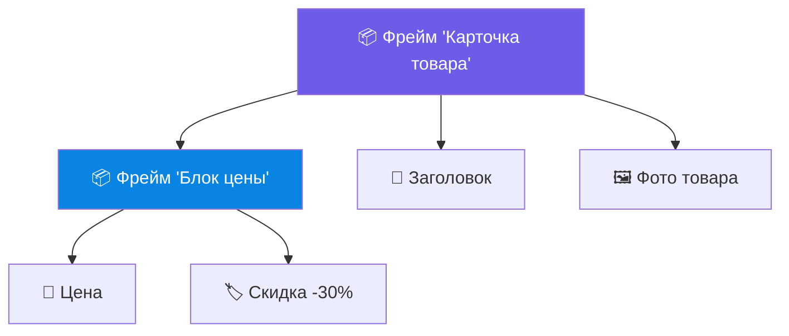
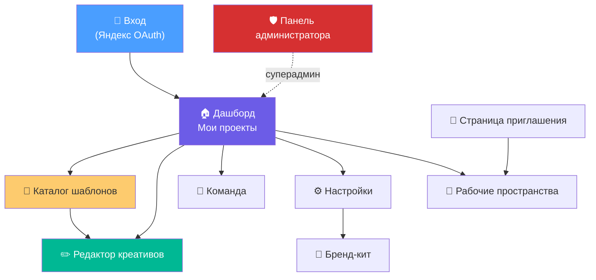
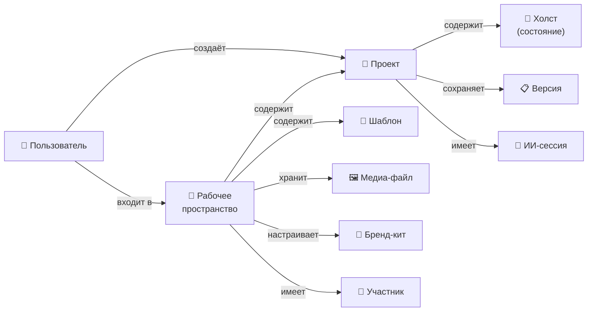
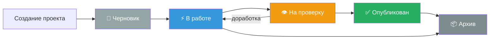
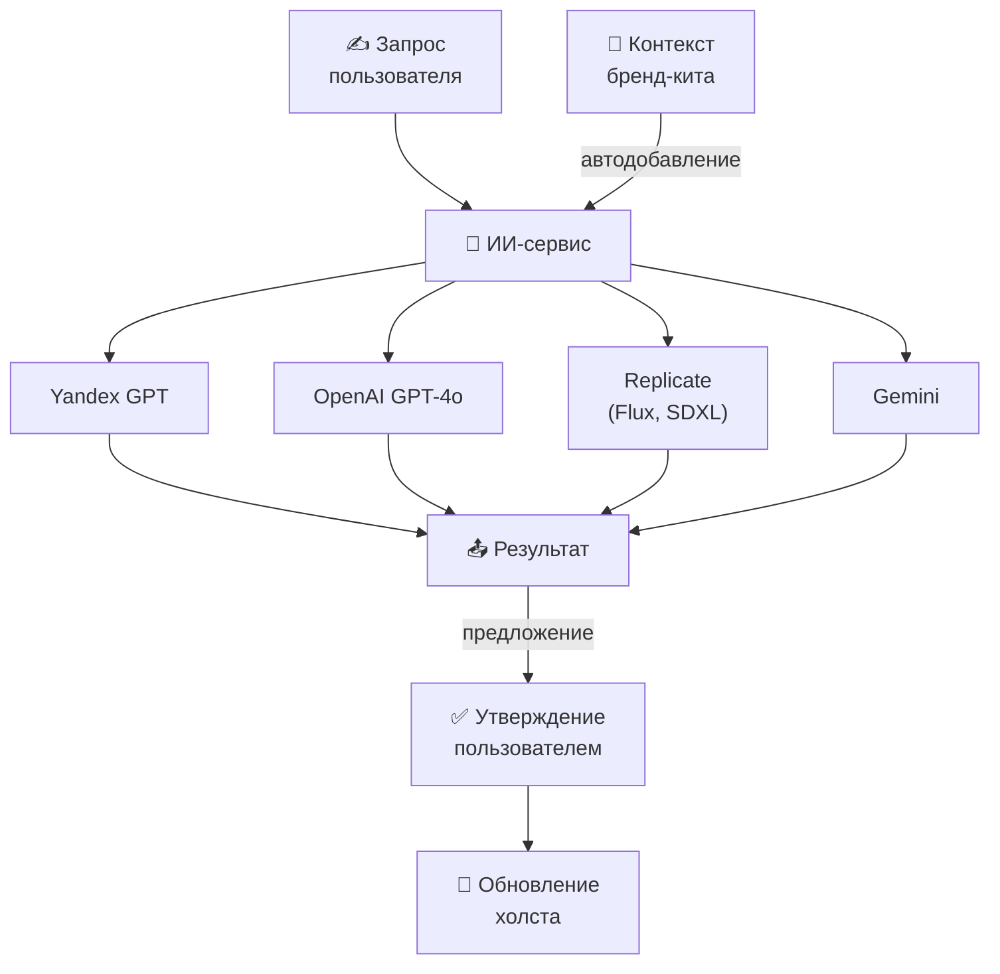
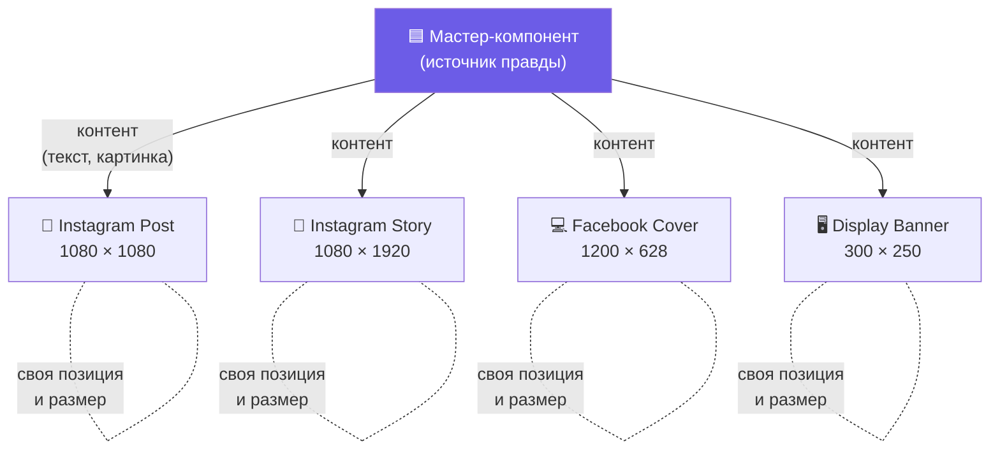
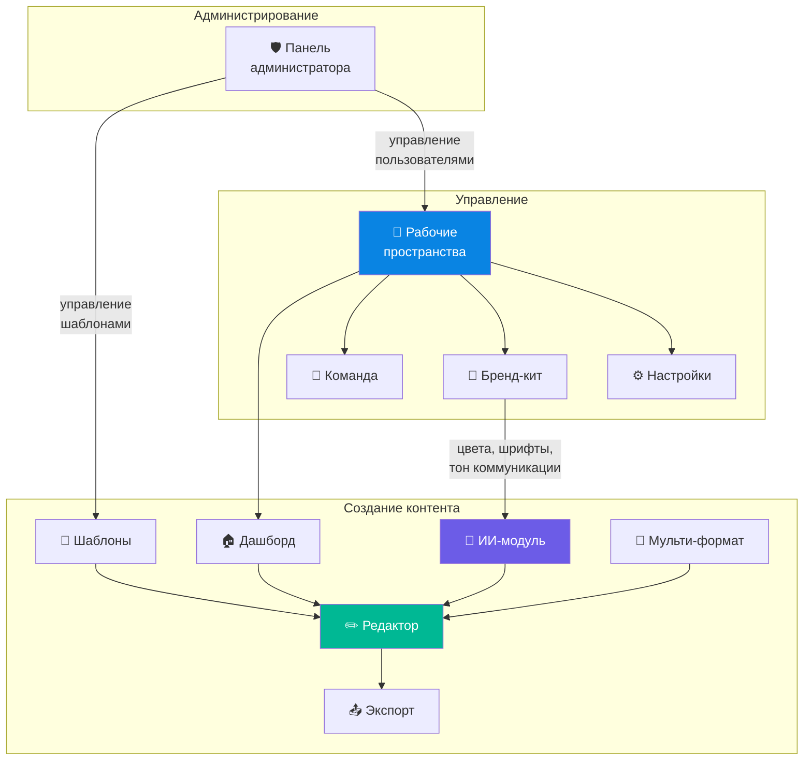

# AI Creative Platform — Функциональная документация

> **Для кого этот документ:** менеджеры, дизайнеры, разработчики и все участники команды.
> Здесь описаны все модули платформы, их возможности, как они связаны между собой и какие сценарии работы доступны пользователям.

---

## 1. Обзор платформы

**AI Creative Platform** — это веб-платформа для создания рекламных и маркетинговых креативов (баннеров, постов для соцсетей, рекламных объявлений) с помощью встроенного ИИ-ассистента. 

Платформа объединяет в себе:
- **Визуальный редактор** (по типу Canva/Figma) для создания и редактирования креативов
- **ИИ-генерацию** текстов и изображений с учётом бренда
- **Систему шаблонов** для быстрого старта
- **Командную работу** с ролями и правами доступа
- **Мульти-формат** — один макет сразу для нескольких размеров (Instagram, Facebook, баннеры и т.д.)

---

## 2. Функциональные модули

### 2.1 🏠 Главная страница (Дашборд)

**Что это:** Первая страница после входа. Центр управления проектами.

**Возможности:**
- Просмотр всех проектов текущего рабочего пространства
- Быстрый запуск нового проекта через карточки «Генерация баннеров», «Генерация текстов», «Генерация фото», «Генерация видео»
- Поиск по проектам
- Добавление проектов в избранное ⭐
- Переименование, изменение статуса и удаление проектов через контекстное меню
- Блок «Готовые наборы» — рекомендованные шаблоны для быстрого старта
- Онбординг для новых пользователей (первый визит в рабочее пространство)

---

### 2.2 ✏️ Редактор креативов (Студия)

**Что это:** Основной инструмент платформы — визуальный редактор для работы с макетами.

**Возможности:**

| Блок | Описание |
|------|----------|
| **Холст** | Рабочая область, где располагаются все элементы креатива (тексты, изображения, фигуры, бейджи, фреймы) |
| **Панель инструментов** | Выбор инструмента: выделение, текст, прямоугольник, изображение, бейдж, фрейм |
| **Панель свойств** | Настройка выбранного элемента: позиция, размер, цвет, шрифт, скругление, прозрачность и т.д. |
| **Панель слоёв** | Дерево всех элементов на холсте с возможностью переименовать, скрыть, заблокировать, перемещать по иерархии |
| **Панель шаблонов** | Применение шаблонов, настройка слотов (какой элемент — заголовок, подзаголовок, фон и т.д.) |
| **Панель форматов** | Управление размерами: добавление форматов (Instagram Post, Facebook Cover, баннеры IAB и т.д.), переключение между ними |
| **ИИ-чат** | Диалоговый ИИ-ассистент, который может модифицировать элементы на холсте, генерировать тексты и изображения |
| **ИИ-промпт-бар** | Быстрый ввод запроса к ИИ прямо над холстом |
| **Контекстное меню** | Правый клик по элементу — копировать, удалить, разблокировать, переместить вверх/вниз |
| **Экспорт** | Выгрузка готового креатива в различных форматах |
| **История версий** | Просмотр и восстановление предыдущих сохранений проекта |

**Два режима работы:**
1. **Пошагово (Wizard)** — мастер с заполнением блоков шаблона по шагам
2. **Студия (Studio)** — полный доступ ко всем инструментам редактора

---

#### 2.2.1 Объекты на холсте

На холсте размещаются пять типов объектов. У каждого есть **общие** и **уникальные** свойства.

**Общие свойства** (есть у всех типов объектов):

| Свойство | Описание |
|----------|----------|
| Позиция (X, Y) | Координаты на холсте |
| Размер (Ширина, Высота) | Геометрические размеры |
| Поворот | Угол поворота в градусах |
| Видимость | Вкл/выкл отображение |
| Блокировка | Защита от случайных изменений |
| Привязки (Constraints) | Как объект ведёт себя при масштабировании (по горизонтали: к левому/правому краю, центру, растянуть, масштаб; по вертикали: аналогично) |
| Роль в шаблоне (Slot) | Семантическая роль: заголовок, подзаголовок, кнопка, фон, главное фото, логотип или без роли |
| Размер в авто-лейауте | Для объектов внутри фрейма с авто-лейаутом: Fixed (фиксированный), Fill (заполнить), Hug (обнять содержимое, только для фреймов) |
| Абсолютное позиционирование | Объект внутри авто-лейаута может «оторваться» от потока и размещаться свободно |

**Уникальные свойства по типам:**

**📝 Текст:**

| Свойство | Описание |
|----------|----------|
| Текст | Содержимое |
| Семейство шрифта | Системные шрифты + пользовательские (.ttf, .otf) |
| Начертание | Light, Regular, Medium, SemiBold, Bold, ExtraBold |
| Кегль | Размер шрифта в пикселях |
| Кернинг | Межбуквенное расстояние |
| Интерлиньяж | Межстрочный интервал |
| Цвет текста | Заливка текста |
| Выравнивание | По левому краю, по центру, по правому краю |
| Регистр | Переключение в ВЕРХНИЙ РЕГИСТР |
| **Контейнер** | Режим контейнера для текста: **Auto Width** (ширина подстраивается под текст, одна строка), **Auto Height** (ширина фиксирована, высота растёт по количеству строк), **Fixed** (оба размера фиксированы) |
| Обрезка текста | Обрезать текст, если не помещается в контейнер |
| Vertical Trim | Убрать лишнее пространство сверху/снизу текста |

**🟦 Прямоугольник (Rectangle):**

| Свойство | Описание |
|----------|----------|
| Заливка | Цвет фона |
| Обводка | Цвет и толщина рамки |
| Радиус скругления | Скругление углов |

**🏷️ Бейдж (Badge):**

| Свойство | Описание |
|----------|----------|
| Метка (Label) | Текст бейджа (напр. «-30%», «Хит») |
| Форма | Pill (скруглённая капсула), Rectangle (прямоугольник), Circle (круг) |
| Фон | Цвет фона бейджа |
| Цвет текста | Цвет текста бейджа |

**🖼️ Изображение (Image):**

| Свойство | Описание |
|----------|----------|
| Замена изображения | Загрузка нового файла |
| Режим подгонки | **Cover** (заполнить, обрезая), **Contain** (уместить целиком), **Fill** (растянуть), **Crop** (кадрирование) |

**📦 Фрейм (Frame):**

| Свойство | Описание |
|----------|----------|
| Авто-лейаут | Горизонтальный, вертикальный или выключен (подробнее ниже) |
| Отступы | Внутренние отступы (вертикальные и горизонтальные) |
| Промежуток | Расстояние между дочерними элементами |
| Выравнивание | По основной и поперечной осям |
| Размер контейнера | Fixed (фиксированный) или Hug (по содержимому) — отдельно по каждой оси |
| Заливка, обводка, скругление | Визуальный стиль самого фрейма |
| Обрезка содержимого (Clip) | Скрывать части дочерних элементов, выступающие за границы фрейма |
| Группа текстов | ID для привязки вложенных текстовых слоёв для совместной ИИ-генерации |

---

#### 2.2.2 Вложенность во фреймах

Фреймы — это **контейнеры**, которые могут содержать внутри себя любые другие объекты, включая **другие фреймы** (вложенные).

**Ключевые правила:**
- Фрейм хранит упорядоченный **список дочерних элементов** (childIds)
- Дочерние элементы отображаются **в порядке списка** (первый — «ниже» в стеке, последний — «выше»)
- Фрейм может быть вложен в другой фрейм, образуя **дерево вложенности**
- При перемещении родительского фрейма всё содержимое перемещается вместе с ним
- Если у фрейма включён **Clip** — части дочерних элементов, выходящие за его границы, обрезаются
- Вложенность циклов **запрещена** — система автоматически обнаруживает и предотвращает ситуации, когда фрейм А содержит фрейм Б, а фрейм Б пытается содержать фрейм А

---

#### 2.2.3 Авто-лейаут

**Что это:** Механизм автоматической раскладки элементов внутри фрейма — аналог «flex-контейнера».

**Режимы направления:**
- **Горизонтальный** — дочерние элементы выстраиваются слева направо
- **Вертикальный** — дочерние элементы выстраиваются сверху вниз
- **Выключен** — свободное размещение

**Настройки:**

| Настройка | Описание |
|-----------|----------|
| Отступы (Padding) | Внутренние отступы от краёв фрейма (верт./гориз.) |
| Промежуток (Spacing) | Расстояние между соседними элементами |
| Выравнивание по основной оси | Start, Center, End, Space Between |
| Выравнивание по поперечной оси | Top/Left, Center, Bottom/Right, Stretch |
| Размер по основной оси | Fixed (задан вручную) или Hug Contents (по содержимому) |
| Размер по поперечной оси | Fixed или Hug Contents |

**Размеры дочерних элементов в авто-лейауте:**
- **Fixed** — размер задан вручную и не меняется
- **Fill** — объект растягивается, чтобы заполнить доступное пространство. Если заполняют несколько объектов — пространство делится поровну
- **Hug** — только для вложенных фреймов: размер определяется содержимым

**Особые поведения:**
- Тексты в режиме «Auto Height» автоматически **пересчитывают высоту** при изменении ширины (например, при Fill)
- Если фрейм в режиме «Hug», а ребёнок в режиме «Fill», ребёнок трактуется как Fixed для вычисления размера фрейма (иначе возникла бы зависимость)
- Вложенные авто-лейауты обрабатываются **изнутри наружу** (сначала вычисляются размеры внутренних фреймов, затем внешних)
- Объект с флагом **«Абсолютное позиционирование»** игнорируется авто-лейаутом и размещается свободно

---

#### 2.2.4 Система привязок (Snap)

При перемещении и изменении размера объектов система помогает выравнивать их аккуратно.

**Четыре типа привязок:**

| Тип | Описание |
|-----|----------|
| **К объектам** | Привязка к краям и центрам других объектов. При приближении к совпадению (в пределах 5 пикселей) объект «притягивается», и появляется тонкая направляющая линия |
| **К артборду** | Привязка к краям и центру рабочей области |
| **К сетке** | Привязка к регулярной сетке (по умолчанию шаг 8 px). Объект округляется до ближайшего узла |
| **К пикселям** | Координаты всегда округляются до целых пикселей для чёткого отображения |

**Умное выравнивание расстояний (Spacing Guides):**
- Если на холсте есть **два объекта с одинаковым расстоянием** между ними, при перемещении третьего объекта система предложит **уравнять промежутки**
- Работает по горизонтали и вертикали
- Помогает быстро строить ритмичные сетки из карточек, кнопок и т.д.

**Измерение расстояний:**
- При зажатом **Alt + наведении** на объект отображаются **расстояния** между выделенным и указанным объектом
- Дистанции показываются в пикселях, с линиями-маркерами
- Работает в четырёх направлениях (вверх, вниз, влево, вправо) и даже по диагонали

---

### 2.3 🎨 Система шаблонов

**Что это:** Каталог готовых макетов для быстрого старта проектов.

**Возможности:**
- Просмотр каталога шаблонов с карточками
- Поиск по названию, описанию и тегам
- Фильтрация по сервису (Маркет, Go, Еда), категории (In-App, SMM, Перформанс и др.), типу контента (визуальный, видео, генеративный)
- Сортировка по популярности, дате, имени
- Официальные шаблоны (от платформы) помечены звездой ⭐
- При выборе шаблона — выбор режима работы: «Пошагово» или «Студия»
- Каждый шаблон содержит набор форматов (размеров) и предзаданную структуру элементов

---

#### 2.3.1 Сохранение собственных шаблонов

Пользователь может сохранить любой проект как шаблон для повторного использования.

**Что записывается в шаблон:**

| Данные | Описание |
|--------|----------|
| Мастер-компоненты | Все объекты со своим типом и всеми свойствами (текст, шрифт, цвет, размеры и т.д.) |
| Дерево слоёв | Полная вложенность: какие объекты внутри каких фреймов, в каком порядке |
| Авто-лейауты | Настройки авто-лейаута фреймов (направление, отступы, промежутки, выравнивание, режимы размеров) |
| Набор форматов | Все доступные размеры (Instagram, баннеры и др.) |
| Метаданные | Название, описание, автор, теги, категории, сервис, тип контента |
| Превью | Миниатюра шаблона для каталога |

**Как шаблон переиспользуется:**
1. При применении шаблона к новому проекту все элементы получают **новые уникальные ID** (чтобы не влиять на оригинал)
2. Вложенность фреймов **полностью восстанавливается** (дерево «разворачивается» обратно)
3. Связи мастер ↔ инстанс пересоздаются с новыми ID
4. Пользователь может **заменить контент** (тексты, картинки) и работать дальше

---

#### 2.3.2 Динамические поля в пошаговом режиме (Wizard)

В пошаговом режиме система **автоматически формирует набор полей** для заполнения, исходя из структуры шаблона.

**Как это работает:**
- Система анализирует **мастер-компоненты** шаблона и определяет, какие из них — текст, изображение или бейдж
- Для каждого текстового элемента появляется **поле ввода текста**
- Для каждого изображения — **поле загрузки файла**
- Для бейджей — **поле ввода метки**

**Группировка текстов:**
- Если в шаблоне есть фреймы с заданным **Group Slot ID** (например, «hero», «promo»), система объединяет все вложенные текстовые элементы в **одну группу**
- ИИ может сгенерировать тексты для всей группы **одним запросом**, чтобы заголовок и подзаголовок были тематически согласованы
- Если Group Slot ID не задан — каждый текстовый элемент выводится как отдельное поле

> **Пример:** Шаблон баннера содержит фрейм «hero» с заголовком и подзаголовком, а также отдельную кнопку. В Wizard появится: (1) группа «hero» с двумя полями + кнопка «Сгенерировать вместе», (2) отдельное поле для текста кнопки.

---

#### 2.3.3 Доступность шаблонов

Шаблоны привязаны к **рабочим пространствам**:
- Каждое рабочее пространство видит только **свои сохранённые шаблоны** + **общедоступные** (официальные шаблоны платформы)
- Шаблоны, созданные в одном пространстве, **не видны** участникам других пространств
- Суперадминистраторы через **панель администратора** могут управлять официальными шаблонами, которые видны всем

---

### 2.4 🤖 ИИ-модуль

**Что это:** Встроенный искусственный интеллект для генерации контента.

**Возможности:**
- **Генерация текстов** — с учётом тона коммуникации бренда, стилей (продающий, информационный, эмоциональный, короткий, развёрнутый)
- **Генерация изображений** — через несколько провайдеров (Yandex GPT, OpenAI, Replicate/Flux)
- **ИИ-агент** — может напрямую изменять элементы на холсте (тексты, цвета, изображения) через диалог
- **Чат-сессии** — история диалогов с ИИ сохраняется для каждого проекта
- **Рабочие процессы ИИ (Workflows)** — готовые сценарии для автоматизации генерации
- **ИИ-редактирование картинок** — набор инструментов для обработки изображений (подробнее ниже)

**Ключевые принципы:**
- ✅ ИИ **предлагает**, человек **утверждает** — никаких необратимых изменений
- ✅ Все изменения от ИИ создают новые слои или версии, **не затирают** существующие
- ✅ ИИ автоматически учитывает **бренд-кит** (цвета, шрифты, тон коммуникации)

---

#### 2.4.1 ИИ-редактирование изображений

Отдельный модуль для обработки изображений с помощью нейросетей.

| Действие | Описание |
|----------|----------|
| **Удаление фона** | Автоматическое вырезание объекта из фона (например, товар без фона для баннера) |
| **Закрашивание области (Inpainting)** | Выбор области маской + текстовый промпт → ИИ заполняет область новым содержимым (замена объекта, удаление лишнего) |
| **Редактирование по тексту** | Текстовое описание изменений → ИИ модифицирует всё изображение (изменить цвет, добавить элемент, изменить стиль) |
| **Расширение кадра (Outpainting)** | Увеличение изображения за пределы исходных границ — ИИ дорисовывает недостающие части |
| **Генерация с нуля** | Создание нового изображения по текстовому описанию |

> Каждое действие может использовать **разные модели** (nano-banana, flux, bria, rembg и др.), которые подбираются автоматически или вручную.

---

### 2.5 📐 Мульти-формат (Smart Resize)

**Что это:** Создание одного креатива сразу для нескольких размеров и платформ.

**Как работает:**
1. Пользователь создаёт макет в основном (мастер) формате
2. Добавляет дополнительные форматы (Instagram Story, Facebook Cover, баннеры и т.д.)
3. **Контент** (тексты, изображения) **синхронизируется** между форматами автоматически
4. **Расположение** элементов настраивается **индивидуально** для каждого формата

**Доступные наборы форматов:**
- 📱 **Соц. сети** — Instagram Post, Instagram Story, Facebook Cover, VK Post
- 🖥️ **Дисплей (баннеры)** — Display Banner, Leaderboard, Skyscraper, Billboard
- 🎬 **Видео** — YouTube Thumbnail, Full HD

---

### 2.6 👥 Рабочие пространства (Workspaces)

**Что это:** Изолированные пространства для команд. Все проекты, шаблоны и медиа-файлы принадлежат рабочему пространству.

**Возможности:**
- Создание нового рабочего пространства
- Обзор и подключение к существующим пространствам
- Настройки видимости: открытое / скрытое
- Политики присоединения: свободный вход / по запросу / только по приглашению
- Ссылка-приглашение для быстрого подключения коллег
- Переключение между пространствами

**Личное и командное пространство:**

Пользователь работает в двух контекстах:

| Контекст | Описание |
|----------|----------|
| **Личное пространство** | Проекты, созданные пользователем лично. Видны только ему. Подходит для черновиков и экспериментов |
| **Командное пространство** | Проекты принадлежат рабочему пространству. Видны всем участникам с соответствующей ролью |

> При переключении рабочего пространства на дашборде меняется **весь контекст**: проекты, шаблоны, бренд-кит, команда.

---

### 2.7 👤 Управление командой

**Что это:** Страница управления участниками рабочего пространства.

**Возможности:**
- Просмотр всех участников с их ролями
- Изменение ролей участников (только для администраторов)
- Удаление участников из команды
- Копирование ссылки-приглашения

**Система ролей:**

| Роль | Что может |
|------|-----------|
| 👁️ **Зритель** | Просмотр проектов и команды |
| 👤 **Участник** | Просмотр + комментирование (планируется) |
| 🎨 **Создатель** | Полноценная работа с проектами и шаблонами |
| 👑 **Администратор** | + управление участниками, настройками, бренд-китом |
| 🛡️ **Суперадмин** | Доступ ко всем пространствам, панель платформы |

---

### 2.8 🎯 Бренд-кит

**Что это:** Настройки фирменного стиля рабочего пространства.

**Три раздела:**
1. **Цвета** — фирменная палитра с именами и назначением каждого цвета
2. **Типографика** — набор шрифтов бренда с вариантами начертаний
3. **Тон коммуникации** — текстовое описание голоса бренда, которое автоматически подставляется во все ИИ-генерации текста

---

### 2.9 ⚙️ Настройки

**Два уровня:**
- **Общие настройки** — профиль пользователя
- **Настройки рабочего пространства** — название, описание, политики доступа (только для администраторов)

---

### 2.10 🛡️ Панель администратора

**Что это:** Панель управления всей платформой (доступна только суперадминистраторам).

**Возможности:**
- Статистика по платформе: количество пользователей, рабочих пространств, проектов
- Управление пользователями и их глобальными ролями
- Управление шаблонами: модерация, дублирование, удаление
- Просмотр всех рабочих пространств платформы

---

### 2.11 🔐 Авторизация и безопасность

**Что это:** Система входа и защиты данных.

**Как работает:**
- Вход через **Яндекс OAuth** (единый аккаунт Яндекса)
- Все страницы защищены — без входа перенаправляет на страницу логина
- Каждый пользователь видит только данные своих рабочих пространств

---

### 2.12 💾 Медиа-файлы (Assets)

**Что это:** Хранилище файлов рабочего пространства.

**Возможности:**
- Загрузка изображений (drag & drop на холст или через панель)
- Хранение в облачном хранилище (совместимом с S3)
- Просмотр и удаление загруженных файлов

---

## 3. Схемы информационной архитектуры

### 3.1 Карта разделов платформы

### 3.2 Структура данных (кто чем владеет)

### 3.3 Жизненный цикл проекта

### 3.4 Работа ИИ-модуля

### 3.5 Мульти-формат (Master / Instance)

---

## 4. Пользовательские сценарии

### 📌 Сценарий 1: Создание баннера с нуля

1. Пользователь заходит на **дашборд**
2. Нажимает карточку **«Генерация баннеров»** или кнопку **«Новый проект»**
3. Вводит название проекта, выбирает цель и формат
4. Открывается **редактор** с пустым холстом
5. Добавляет элементы: текст, изображения, фигуры
6. Настраивает свойства каждого элемента через **панель свойств**
7. Использует **ИИ-чат** для генерации текстов или изображений
8. Добавляет дополнительные форматы через **панель форматов**
9. Экспортирует готовый креатив

### 📌 Сценарий 2: Быстрый старт с шаблоном

1. Пользователь переходит в **каталог шаблонов**
2. Фильтрует по нужному сервису (Маркет, Go) и категории (SMM, Перформанс)
3. Выбирает подходящий шаблон
4. Выбирает режим: **«Пошагово»** (мастер) или **«Студия»** (свободная работа)
5. В пошаговом режиме — заполняет контент-блоки один за другим
6. В режиме студии — свободно редактирует макет
7. Экспортирует результат

### 📌 Сценарий 3: Адаптация под несколько форматов

1. Пользователь создаёт баннер в формате **Instagram Post (1080×1080)**
2. Через **панель форматов** добавляет **Instagram Story, Facebook Cover, Display Banner**
3. Контент (тексты, картинки) автоматически переносится во все форматы
4. Пользователь переключается между форматами и **корректирует расположение** элементов
5. Экспортирует все форматы одновременно

### 📌 Сценарий 4: ИИ-генерация текста для рекламы

1. В **редакторе** пользователь выделяет текстовый элемент
2. Открывает **ИИ-чат** или вводит промпт в **промпт-баре**
3. Промпт автоматически дополняется **тоном коммуникации** из бренд-кита
4. ИИ генерирует несколько вариантов текста
5. Пользователь **выбирает подходящий** — текст появляется как новый слой
6. Старый текст сохраняется, ничего не перезаписывается

### 📌 Сценарий 5: Настройка бренд-кита

1. **Администратор** рабочего пространства переходит в **Настройки → Бренд-кит**
2. Добавляет **фирменные цвета** с названиями (например, «Основной жёлтый», «Фоновый серый»)
3. Добавляет **шрифты** бренда с нужными начертаниями
4. Описывает **тон коммуникации** — «дружелюбный, неформальный, с юмором»
5. Далее все ИИ-генерации в этом пространстве автоматически учитывают эти настройки

### 📌 Сценарий 6: Приглашение коллег в команду

1. **Администратор** открывает страницу **«Команда»**
2. Нажимает **«Скопировать ссылку-приглашение»**
3. Отправляет ссылку коллегам
4. Коллеги переходят по ссылке, авторизуются через Яндекс и присоединяются к пространству
5. Администратор назначает каждому участнику роль (Зритель / Участник / Создатель / Администратор)

### 📌 Сценарий 7: Работа с историей версий

1. Пользователь открывает проект в **редакторе**
2. Открывает **панель «История версий»**
3. Видит список сохранённых версий с датами
4. Выбирает нужную версию — она загружается на холст
5. При необходимости **восстанавливает** предыдущее состояние

### 📌 Сценарий 8: Генерация фото через ИИ

1. На **дашборде** пользователь нажимает карточку **«Генерация фото»**
2. Автоматически создаётся новый проект и открывается **редактор** с ИИ-панелью
3. Пользователь описывает желаемое изображение в чате
4. ИИ генерирует изображение через один из провайдеров
5. Результат добавляется на холст как слой

---

## 5. Взаимосвязи модулей

---

## 6. Глоссарий

| Термин | Простое пояснение |
|--------|-------------------|
| **Рабочее пространство** | Общая «комната» для команды со своими проектами, шаблонами и настройками |
| **Проект** | Один креатив или набор креативов для разных форматов |
| **Шаблон** | Готовый макет с предзаданной структурой для быстрого старта |
| **Холст** | Рабочая область редактора, где размещаются все элементы |
| **Слой** | Отдельный элемент на холсте (текст, картинка, фигура, бейдж, фрейм) |
| **Фрейм** | Контейнер, который может группировать несколько слоёв и автоматически выстраивать их |
| **Бейдж** | Компактная метка (например, «-30%», «Новинка») |
| **Мастер-компонент** | Главный элемент, который «раздаёт» свой контент во все форматы |
| **Формат** | Конкретный размер макета (1080×1080 для Instagram, 1200×628 для Facebook и т.д.) |
| **Бренд-кит** | Набор фирменных цветов, шрифтов и тона коммуникации |
| **Тон коммуникации** | Описание «голоса» бренда, которое подаётся ИИ для генерации текстов |
| **Слот** | Место в шаблоне с определённой ролью (заголовок, подзаголовок, фон, кнопка действия) |
| **Экспорт** | Выгрузка готового макета в файл для публикации |
| **ИИ-агент** | Серверный ИИ, умеющий напрямую изменять элементы на холсте по текстовой команде |
| **Авто-лейаут** | Автоматическая раскладка элементов внутри фрейма (горизонтально или вертикально) |
| **Привязка (Snap)** | Автоматическое «притягивание» объекта к краям, центрам других объектов или к сетке |
| **Контейнер текста** | Режим поведения текста: автоширина (одна строка), автовысота (фикс. ширина) или фиксированный |
| **Inpainting** | Замена выделенной области изображения с помощью ИИ |
| **Outpainting** | Расширение изображения за его исходные границы с помощью ИИ |
| **Group Slot ID** | Идентификатор группы, связывающий текстовые слои для совместной ИИ-генерации |

---

## 7. Статусы разработки (по модулям)

| Модуль | Статус |
|--------|--------|
| 🏠 Дашборд | ✅ Готов |
| ✏️ Редактор | ✅ Готов (основные функции) |
| 🎨 Шаблоны | ✅ Готов |
| 🤖 ИИ (тексты, изображения) | ✅ Готов |
| 📐 Мульти-формат | ✅ Готов |
| 👥 Команда | ✅ Готов |
| 🎯 Бренд-кит | ✅ Готов |
| ⚙️ Настройки | ✅ Готов |
| 🛡️ Панель администратора | ✅ Готов |
| 🔐 Авторизация | ✅ Готов |
| 💬 Комментарии | 🔮 Планируется |
| 🔄 Совместная работа в реальном времени | 🔮 Планируется |
| 🎬 Видео-креативы | 🔮 Планируется |
| 📊 A/B-тестирование вариантов | 🔮 Планируется |
| 🔌 Внешний API для автогенерации | 🔮 Планируется |
