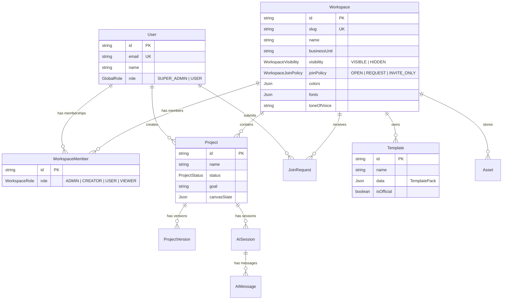

# AI Creative Platform — Technical Architecture (To-Be)

> **Purpose:** Reference document for all development agents. Describes the target architecture, data models, API surface, and file structure. When implementing features, follow this structure — do not create parallel patterns.

---

## Stack

| Layer | Technology |
|-------|-----------|
| **Framework** | Next.js 15 (App Router) |
| **Language** | TypeScript (strict mode) |
| **State** | Zustand (canvas), React Context (workspace, theme) |
| **API** | tRPC v11 (type-safe client ↔ server) |
| **DB** | PostgreSQL (Yandex Managed) via Prisma ORM |
| **Auth** | NextAuth v5 (Yandex OAuth) + dev bypass |
| **Storage** | Yandex Object Storage (S3-compatible) |
| **AI** | Multi-provider: Yandex GPT, OpenAI, Replicate |
| **Canvas** | Konva.js (HTML5 Canvas) |
| **Styling** | Tailwind CSS + CSS custom properties (design tokens) |

---

## File Structure

```
src/
├── app/                    # Next.js pages (App Router)
│   ├── page.tsx            # Dashboard (project list)
│   ├── projects/           # All projects view
│   ├── templates/          # Template catalog
│   ├── team/               # Team management
│   ├── editor/[id]/        # Canvas editor
│   ├── admin/              # Super-admin panel
│   │   └── templates/      # Template admin
│   ├── settings/
│   │   ├── page.tsx        # General settings
│   │   ├── brand-kit/      # Brand identity settings
│   │   └── workspace/      # Workspace settings (admin)
│   ├── invite/[slug]/      # Public invite page
│   ├── auth/signin/        # Auth page
│   └── api/
│       ├── trpc/[trpc]/    # tRPC HTTP handler
│       ├── ai/             # AI API routes (generate, image-edit)
│       ├── canvas/save/    # Beacon save endpoint
│       └── auth/           # NextAuth handlers
│
├── components/
│   ├── layout/             # AppShell, Sidebar, TopBar
│   ├── editor/             # Canvas, PropertiesPanel, TemplatePanel, AI panels
│   ├── wizard/             # WizardFlow, content blocks
│   ├── workspace/          # WorkspaceBrowseModal, CreateWorkspaceModal
│   ├── dashboard/          # NewProjectModal, ProjectCard
│   ├── auth/               # UserMenu, SignIn
│   ├── providers/          # ThemeProvider
│   └── ui/                 # Button, Modal, Badge, Tabs (primitives)
│
├── server/
│   ├── trpc.ts             # tRPC init, context, procedures (public/protected/superAdmin)
│   ├── auth.ts             # NextAuth configuration
│   ├── db.ts               # Prisma client singleton
│   ├── routers/
│   │   ├── _app.ts         # Root router (merges all)
│   │   ├── auth.ts         # Session, user profile
│   │   ├── workspace.ts    # CRUD, membership, join requests, RBAC
│   │   ├── project.ts      # Project CRUD, versions, favorites
│   │   ├── template.ts     # Template CRUD, catalog
│   │   ├── asset.ts        # File upload/delete (S3)
│   │   ├── ai.ts           # AI session, messages, system prompts
│   │   ├── workflow.ts     # AI workflow templates
│   │   ├── admin.ts        # Platform-wide stats, user management
│   │   └── adminTemplate.ts # Global template management
│   ├── agentOrchestrator.ts # AI agent with tool-calling
│   └── actionRegistry.ts   # Canvas action definitions for AI agent
│
├── store/
│   ├── canvasStore.ts      # Main editor state (layers, tools, undo/redo, components)
│   ├── projectStore.ts     # Active project metadata
│   ├── templateStore.ts    # Applied template state
│   ├── brandKitStore.ts    # Brand identity state
│   ├── aiStore.ts          # AI generation state
│   ├── badgeStore.ts       # Badge component config
│   └── themeStore.ts       # UI theme settings
│
├── hooks/
│   ├── useProjectSync.ts   # Project auto-save to DB
│   ├── useProjectVersions.ts # Version history
│   ├── useTemplateSync.ts  # Template save to DB
│   ├── useAssetUpload.ts   # S3 upload hook
│   ├── useAISessionSync.ts # AI chat persistence
│   └── useKeyboardShortcuts.ts
│
├── services/
│   ├── aiService.ts        # AI API client
│   ├── templateService.ts  # Template pack parser/applier
│   ├── templateCatalogService.ts # Template search/filter
│   ├── layoutEngine.ts     # Layout rules for template slots
│   ├── snapService.ts      # Snap-to-grid/guides
│   ├── smartResizeService.ts # Multi-format content adaptation
│   └── slotMappingService.ts # Template slot → layer mapping
│
├── providers/
│   ├── WorkspaceProvider.tsx # Workspace context + switcher
│   └── TRPCProvider.tsx     # tRPC client setup
│
├── lib/
│   ├── trpc.ts             # tRPC client hooks
│   ├── cn.ts               # classnames utility
│   ├── ai-providers.ts     # AI provider implementations (server)
│   ├── ai-models.ts        # Model registry (client-safe)
│   └── customFonts.ts      # Font loading (IndexedDB + Google Fonts)
│
├── config/                 # Feature flags, app config
├── constants/              # Default packs, presets
├── types/
│   ├── index.ts            # Core types (Layer, Component, Template, BrandKit)
│   └── api-types.ts        # API request/response types
└── middleware.ts            # Route protection (auth cookie check)
```

---

## Data Model



### Role Hierarchy

**Global:** `USER` < `SUPER_ADMIN`
**Workspace:** `VIEWER` < `USER` < `CREATOR` < `ADMIN`

| Role | Capabilities |
|------|-------------|
| `VIEWER` | View projects, team |
| `USER` | View + comment (future) |
| `CREATOR` | Full create/edit on projects, templates |
| `ADMIN` | + manage members, settings, brand kit |
| `SUPER_ADMIN` | Platform-wide admin panel, all workspaces |

---

## Canvas Architecture (Master/Instance)

The editor uses a **master component / instance** pattern for multi-format design:

```
MasterComponent (source of truth)
  ├── Layer in Format A (instance)
  ├── Layer in Format B (instance)
  └── Layer in Format C (instance)
```

- **Master** defines content (text, image src)
- **Instances** have local layout (x, y, width, height)
- **Content cascades** from master → instances (text, src)
- **Layout stays local** per format

### Canvas State

```typescript
interface CanvasState {
    layers: Layer[];                    // Flat list of visible layers
    masterComponents: MasterComponent[];
    componentInstances: ComponentInstance[];
    resizes: ResizeFormat[];            // Available formats
    activeResizeId: string;
    artboardProps: ArtboardProps;
    // ... tools, zoom, selection, history
}
```

**Saved as:** `Project.canvasState` (JSON blob in PostgreSQL)

---

## API Surface (tRPC Routers)

| Router | Key Procedures |
|--------|---------------|
| `auth` | `getSession`, `me` |
| `workspace` | `list`, `listAll`, `create`, `join`, `leave`, `update`, `delete`, `listMembers`, `updateMemberRole`, `removeMember`, `requestJoin`, `listJoinRequests`, `handleJoinRequest` |
| `project` | `list`, `create`, `getById`, `save`, `delete`, `listVersions`, `restoreVersion`, `listFavorites`, `toggleFavorite` |
| `template` | `list`, `create`, `update`, `delete`, `getById` |
| `asset` | `upload`, `list`, `delete` |
| `ai` | `listSessions`, `getSession`, `sendMessage`, `listSystemPrompts` |
| `workflow` | `list`, `create`, `execute` |
| `admin` | `stats`, `users`, `workspaces`, `updateUserRole` |
| `adminTemplate` | `list`, `update`, `duplicate`, `delete` |

---

## AI Integration

### Multi-Provider Architecture

```
User Prompt → AI Service → Provider Router → Provider Implementation
                                              ├── Yandex GPT (text)
                                              ├── OpenAI GPT-4o (text + image)
                                              ├── Replicate (Flux, SDXL)
                                              └── Gemini (text)
```

**Key principle:** AI suggestions are non-destructive. All AI changes create new layers or versions, never overwrite existing content.

### Agent Orchestrator
Server-side AI agent with tool-calling capability that can:
- Modify canvas layers (text, images, colors)
- Apply templates
- Generate content in context of brand guidelines

---

## Auth Flow

```
Browser → Middleware (cookie check)
  ├── Has session cookie → Allow
  └── No cookie → Redirect to /auth/signin
       └── Yandex OAuth → Callback → Session created

Dev Mode: Auto-creates dev@acp.local user with SUPER_ADMIN role
```

---

## Key Design Decisions

1. **Canvas state as JSON blob** — Entire canvas serialized to `Project.canvasState`. Simple but limits granular queries. Acceptable for current scale.
2. **Master/Instance pattern** — Enables multi-format design from single source. Content cascades, layout stays local.
3. **Workspace-scoped everything** — Projects, templates, assets, prompts belong to a workspace. Cross-workspace sharing not yet needed.
4. **tRPC for all data** — Type-safe end-to-end. AI endpoints are separate API routes (streaming, long-running).
5. **Dev auth bypass** — Auto-creates dev user in development mode to avoid OAuth setup.
